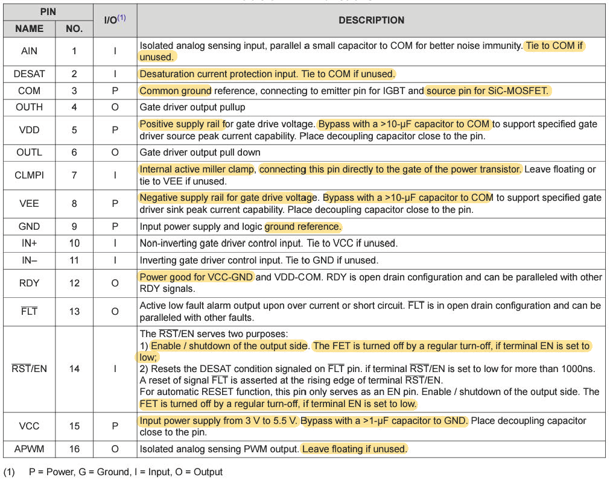

# SiC-MOSFET-Gate-Driver-Design-R1
A personal project for developing a Silicon Carbide Gate Driver board based on TI's UCC21750 IC.

<figure>

<figcaption>Fig.1 Pinout of UCC21750.</figcaption>
</figure>

<figure>

<figcaption>Fig.2 Pin functions of UCC21750.</figcaption>
</figure>
